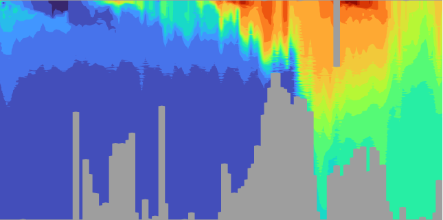
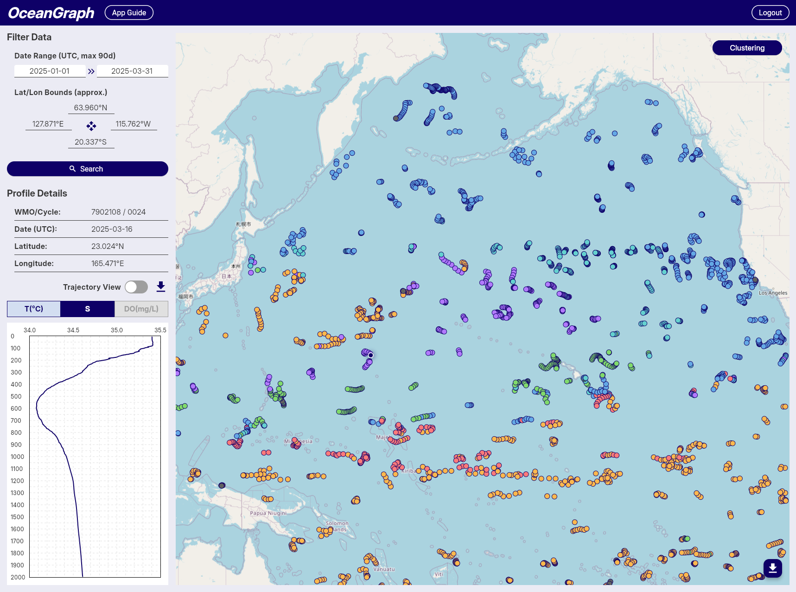

## Limitations & Usage Notes

### 1. Missing Values in Vertical Section Charts

1. Masked Areas Without Original Data

    When generating time-series vertical section charts of Argo float data, interpolation (e.g., using scipy.interpolate.griddata) is used to transform irregularly spaced profile data into a regular grid. Some areas may remain unfilled where original profile data are missing. To address this, we apply a mask after gridding to exclude regions without valid observations, setting those values to NaN.

    In the example image below, these masked areas appear as uncolored gaps in the vertical section.

2. Sparse Data Due to Quality Control

    After applying quality control, some profiles may be excluded, resulting in a sparser time series. Even if valid profiles are present at certain time steps, the interpolation process may not be able to generate a continuous vertical section. This leads to sections where observation points exist (trajectory figure) but the interpolated chart shows gray or missing areas (vertical section figure), indicating insufficient data density for interpolation.

    This can be seen in the same image where gray regions appear in the section chart, even though observation points are visible in the trajectory chart above.

Please keep this in mind when interpreting the charts.

### 2. Clustering (Beta)

OceanGraph provides a beta feature that clusters Argo profiles based on their vertical structure using machine learning. This functionality is experimental and comes with the following limitations and processing steps:

1. Profile Limit

   - To reduce server load and memory usage, clustering accepts a maximum of 500 valid profiles per job.

2. Depth Range & Interpolation

   - Only the range between 200 and 1000 dbar is used.
   - Profiles are linearly interpolated every 100 dbar within this range to align them on a common vertical grid.
   - The upper 200 dbar is omitted to suppress the effects of seasonal thermocline and surface forcing.

3. Required Variables

   - Only profiles containing valid temperature and salinity data are considered.
   - Profiles missing these variables or lacking coverage in the specified depth range are excluded.

4. Clustering Feature Vector

   - Clustering is based on a feature vector composed of interpolated temperature and salinity values, combined with location data.
   - Temperature and salinity vectors are standardized using z-score normalization at each depth level to ensure that variations at all depths contribute equally to the clustering process.
   - Latitude is included as an additional feature, normalized by linear scaling from -90 to 90 degrees into a range of -1 to 1.
   - Longitude is transformed into two features using its sine and cosine values (i.e., sin(λ), cos(λ)), allowing for circular continuity around the ±180° meridian without further normalization.

5. Automatic K Determination

   - The number of clusters (K) is selected automatically using a simplified elbow method (with a maximum of 8 clusters).

This feature is available to **signed-in users only**. While we are actively improving this system, unexpected results or limitations may occur. We appreciate your understanding during this beta period.

**Note:** Gray markers indicate profiles that were excluded from clustering.

### 3. Mixed Layer Depth (MLD)

OceanGraph calculates the mixed layer depth (MLD) from individual Argo float profiles based on potential density (σθ). This method follows a simplified version of the classical density threshold approach, commonly used in oceanography.

1. Potential Density Calculation

   - MLD is determined from the vertical profile of potential density (σθ), which is estimated using a simplified version of the UNESCO 1983 equation.
   - To keep the processing lightweight and dependency-free, we avoid using libraries like gsw or xarray and instead apply a polynomial approximation based on in-situ temperature, practical salinity, and pressure.
   - This approximation is sufficient for MLD estimation but may not be suitable for studies requiring high-precision density values.

2. MLD Definition and Threshold

   - The MLD is defined as the shallowest depth where σθ increases by more than 0.03 kg/m³ relative to the value at 10 dbar.
   - This threshold-based method is widely adopted in oceanographic literature and provides a practical way to estimate the depth of the surface mixed layer.
   - If no such depth is found in the profile, the MLD is considered undefined for that observation.

3. Conversion to Depth

   - The estimated MLD (in decibars) is converted into physical depth (in meters) using a latitude-dependent formula from the UNESCO 1983 standard.
   - This allows MLD values to be visualized spatially or compared across different regions with consistent units.

4. Color Representation

   - For visualizations such as maps, MLD values are mapped to colors using the reversed Viridis colormap (viridis_r in matplotlib), with shallow layers represented in brighter colors and deeper layers in darker tones.
   - Missing or undefined MLDs are shown in gray.

This approach ensures efficient and consistent estimation of mixed layer depth across a wide range of Argo float profiles while maintaining reasonable accuracy for visualization and exploratory analysis.
