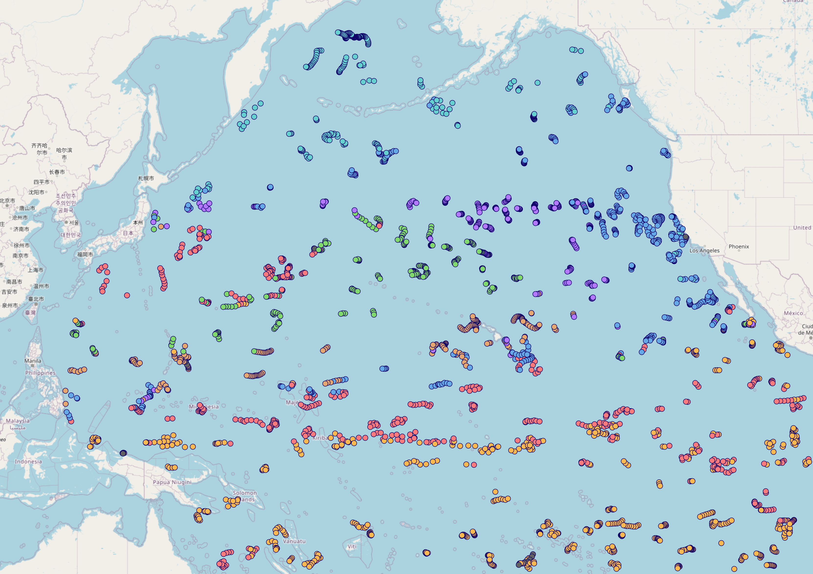

## Limitations & Usage Notes

### Missing Values in Vertical Section Charts

1. Masked Areas Without Original Data

    When generating time-series vertical section charts of Argo float data, interpolation (e.g., using scipy.interpolate.griddata) is used to transform irregularly spaced profile data into a regular grid. Some areas may remain unfilled where original profile data are missing. To address this, we apply a mask after gridding to exclude regions without valid observations, setting those values to NaN.

    In the example image below, these masked areas appear as uncolored gaps in the vertical section.

2. Sparse Data Due to Quality Control

    After applying quality control, some profiles may be excluded, resulting in a sparser time series. Even if valid profiles are present at certain time steps, the interpolation process may not be able to generate a continuous vertical section. This leads to sections where observation points exist (trajectory figure) but the interpolated chart shows gray or missing areas (vertical section figure), indicating insufficient data density for interpolation.

    This can be seen in the same image where gray regions appear in the section chart, even though observation points are visible in the trajectory chart above.

Please keep this in mind when interpreting the charts.

### Clustering (Beta)

OceanGraph provides a beta feature that clusters Argo profiles based on their vertical structure using machine learning. This functionality is experimental and comes with the following limitations and processing steps:

#### Profile Limit

- To reduce server load and memory usage, clustering accepts a maximum of 500 valid profiles per job.

#### Depth Range & Interpolation

- Only the range between 200 and 1000 dbar is used.
- Profiles are linearly interpolated every 100 dbar within this range to align them on a common vertical grid.

#### Required Variables

- Only profiles containing valid temperature and salinity data are considered.
- Profiles missing these variables or lacking coverage in the specified depth range are excluded.

#### Clustering Basis

- Clustering is based on combined temperature and salinity vectors after standardization (z-score).

#### Automatic K Determination

- The number of clusters (K) is selected automatically using a simplified elbow method.

This feature is available to **signed-in users only**. While we are actively improving this system, unexpected results or limitations may occur. We appreciate your understanding during this beta period.

