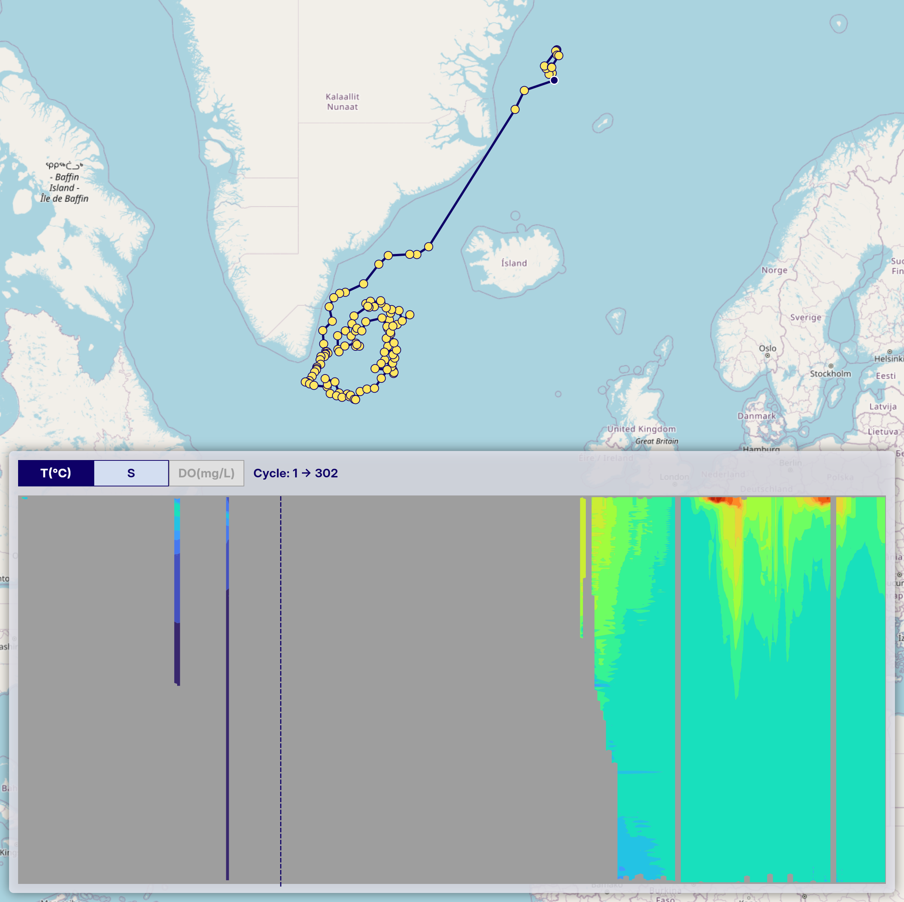

## Limitations & Usage Notes

### Missing Values in Vertical Section Charts

When generating time-series vertical section charts of Argo float data, interpolation (e.g., using `scipy.interpolate.griddata`) is applied to convert irregular profile data into a regular grid. In some cases, this process may leave certain areas in the chart unfilled. To address this, we apply a mask after gridding to exclude regions that fall outside the original profile range—both shallower and deeper—setting those values to NaN.

The example below shows a vertical section chart where unfilled (masked) regions correspond to areas beyond the original profile depth range.

Please keep this in mind when interpreting the charts.
