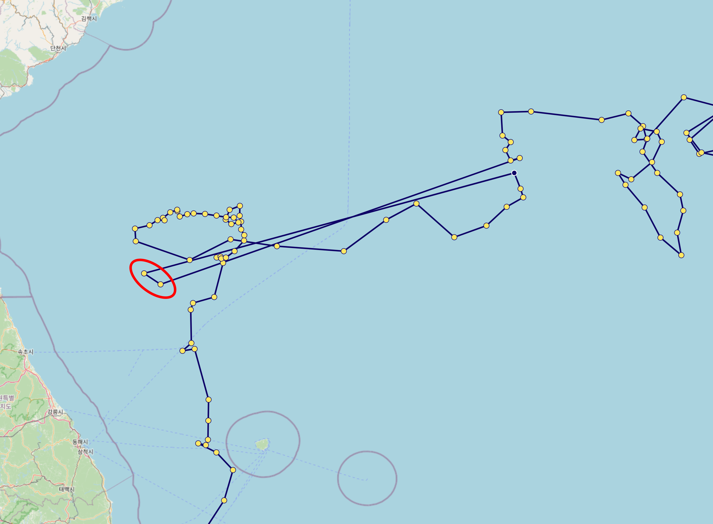

## 1. Introduction

OceanGraph is a web platform for visualizing and analyzing Argo float oceanographic data. It offers interactive tools and profile information for researchers, students, and ocean enthusiasts.

## 2. Main Features

- Search Argo floats worldwide by region and time
- Visualize vertical profiles of temperature, salinity, and oxygen
- Explore trajectories of individual floats
- Download observation profile data for custom analysis
- Save screenshots of search results and visualizations

## 3. Data Source

These data were collected and made freely available by the International Argo Program and the national programs that contribute to it ([http://www.argo.ucsd.edu](http://www.argo.ucsd.edu), [http://argo.jcommops.org](http://argo.jcommops.org)).
The Argo Program is part of the Global Ocean Observing System.

DOI: Argo (2000). Argo float data and metadata from Global Data Assembly Centre (Argo GDAC). SEANOE. [http://doi.org/10.17882/42182](http://doi.org/10.17882/42182)

## 4. Data Filtering Policy

In OceanGraph, only carefully selected Argo float profiles are used according to the following conditions:

1. Selection of Profiles

    - Only profiles in delayed mode (files starting with `D` or `BD`) are used.
    - Drift profiles (those with a `D` at the end of `CYCLE_NUMBER`) are excluded.

2. Required Variables

    Only profiles that include all of the following variables are used:

    - `PLATFORM_NUMBER`
    - `CYCLE_NUMBER`
    - `DATE_CREATION`
    - `LATITUDE`
    - `LONGITUDE`
    - `PRES_ADJUSTED`
    - `PRES_ADJUSTED_QC`
    - `TEMP_ADJUSTED`
    - `TEMP_ADJUSTED_QC`
    - `PSAL_ADJUSTED`
    - `PSAL_ADJUSTED_QC`

3. Position Quality Control

    - Only profiles with `POSITION_QC` values of 1 or 2 are used.
    - While the `POSITION_QC` check is passed, some data may still be unreliable, as shown in the red circle below. Please interpret with caution.

        

4. Sorting of Data

    The profiles are sorted in ascending order of `PRES_ADJUSTED`, and the following variables are reordered accordingly:

    - `PRES_ADJUSTED_QC`
    - `TEMP_ADJUSTED`
    - `TEMP_ADJUSTED_QC`
    - `PSAL_ADJUSTED`
    - `PSAL_ADJUSTED_QC`
    - `DOXY_ADJUSTED` (if available)
    - `DOXY_ADJUSTED_QC` (if available)

5. Depth Range Restriction

    Only data from depths shallower than **2000 dbar** are retained.

6. Profile Quality Filtering

    Only profiles where at least **80%** of `PRES_ADJUSTED_QC`, `TEMP_ADJUSTED_QC`, and `PSAL_ADJUSTED_QC` flags are either 1 or 2 are kept.

7. Layer-by-Layer Filtering

    - Only layers where the QC flags for pressure, temperature, and salinity are all 1 or 2 are kept.
    - For dissolved oxygen (`DOXY_ADJUSTED`):
        - Data are kept if the corresponding pressure, temperature, and salinity flags are all 1 or 2.
        - The QC flag of DOXY itself is not used for filtering. This is because oxygen sensor quality can vary significantly, and applying its QC flag strictly may severely limit the available data.
        - Users should carefully interpret dissolved oxygen data due to potential sensor uncertainties.

    | pres_qc | temp_qc | psal_qc | doxy_qc | judgement |
    |---------|---------|---------|---------|-----------|
    | 1 or 2  | 1 or 2  | 1 or 2  | 1 or 2  | PASS      |
    | 0       | 1 or 2  | 1 or 2  | 1 or 2  | NG        |
    | 1 or 2  | 0       | 1 or 2  | 1 or 2  | NG        |
    | 1 or 2  | 1 or 2  | 0       | 1 or 2  | NG        |
    | 1 or 2  | 1 or 2  | 1 or 2  | 0 (*)   | PASS      |

    ***: DOXY quality flag not assigned**

## 5. Legal Information

For details regarding the terms of use and privacy policy, please refer to the following documents:

- [Terms of Service (English)](./docs/terms_of_use_en.md)
- [Privacy Policy (English)](./docs/privacy_policy_en.md)

For documents in Japanese:

- [利用規約（日本語）](./docs/terms_of_use_ja.md)
- [プライバシーポリシー（日本語）](./docs/privacy_policy_ja.md)

## 6. Contact Information

- If you encounter any bugs or have feature requests, please submit them via [Issues](https://github.com/Unvelyze/oceangraph-guide/issues).
- For other inquiries, feel free to contact us at support(at)unvelyeze.com.
