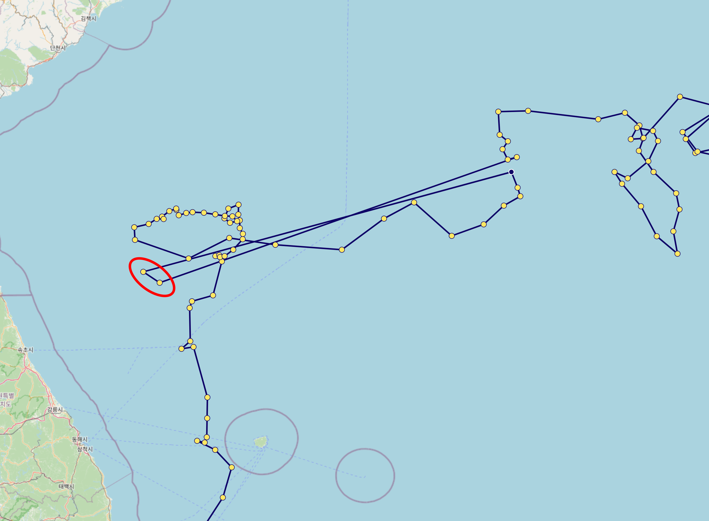

# Data filtering policy

In OceanGraph, only carefully selected Argo float profiles are used according to the following conditions:

## 1. Selection of profiles

### 1-1. File-level selection

- Only real-time (`R`, `BR`) and delayed-mode (`D`, `BD`) profiles are used.
- If both real-time and delayed-mode profiles exist for the same cycle, the delayed-mode profile (D or BD) is preferred.
- Drift profiles (those whose filename has a cycle number suffix ending in `D`, e.g. `R1234567_027D.nc`) are excluded.

### 1-2. Best-profile selection within a file

Some NetCDF files contain multiple profiles (`N_PROF > 1`) — for example, when a float records both descending and ascending phases in the same cycle, or when a Bio-Argo file stores data from different BGC sensors as separate profiles.

**Note:** The file-level D/BD preference (section 1-1) and the within-file `DATA_MODE`-based selection (section 1-2) are independent mechanisms and may both apply to the same cycle.

#### TS profile selection

When a TS file contains more than one profile, the following algorithm selects the best candidate:

| Step | Type | Rule |
| --- | --- | --- |
| Step 0 | Pre-filter | Candidates with invalid `JULD_QC` or `POSITION_QC` are removed. If all candidates fail, no filtering is applied at this step (they will be rejected in the QC stage below). |
| Step 1 | Hard rule | Profiles with `DIRECTION == 'A'` (ascending) are preferred. If no ascending profile exists, all remaining candidates are kept. |
| Step 2 | Hard rule | Profiles are filtered by `DATA_MODE` priority: `D` (delayed mode) > `A` (adjusted real-time) > `R` (real-time). |
| Step 3 | Tie-breaker | If multiple candidates remain, the profile with the highest quality score is selected. The score is based on the presence of `_ADJUSTED` data, the count of valid QC flags, and the valid pressure range. |

Steps 0–2 are **hard rules** that narrow down candidates according to Argo specification priorities. Step 3 (scoring) is used only when the hard rules cannot determine a single winner.

**Why ascending profiles are preferred:** Argo floats collect data primarily during the ascending phase. Sensors stabilize during ascent, and delayed-mode quality control (DMQC) targets ascending profiles. Ascending profiles are therefore preferred both physically and operationally.

#### BGC parameter selection

Bio-Argo files (BR/BD) have their own `N_PROF` dimension, independent of the corresponding TS file. Different BGC sensors may be stored as separate profiles within the same file due to sensor-specific processing — for example, DOXY in profile 0 and CHLA in profile 1. For this reason, **each BGC parameter independently selects its own best profile** rather than using a single shared index.

For each BGC parameter, the selection proceeds as follows:

1. Profiles that contain valid data for the parameter (using `_ADJUSTED` if available, otherwise raw) are identified as candidates.
2. Candidates whose pressure levels match those of the selected TS profile (using raw `PRES`) are retained. If no candidate matches, the parameter is treated as absent for that profile.
3. If multiple candidates remain, selection follows the same DIRECTION → `DATA_MODE` → tie-breaker scoring order as TS profile selection.

**Note:** The pressure matching in step 2 applies regardless of `N_PROF`. Even when a Bio-Argo file contains only one profile, if its pressure levels do not match those of the selected TS profile, the BGC parameter is treated as absent for that cycle.

## 2. Required variables

Only profiles that include all of the following variables are used:

- `PLATFORM_NUMBER`
- `CYCLE_NUMBER`
- `JULD`
- `JULD_QC`
- `LATITUDE`
- `LONGITUDE`
- `POSITION_QC`
- `PRES`
- `PRES_QC`
- `TEMP`
- `TEMP_QC`
- `PSAL`
- `PSAL_QC`

**Note:** The `_ADJUSTED` variables (`PRES_ADJUSTED`, `TEMP_ADJUSTED`, `PSAL_ADJUSTED` and their QC flags) are also included. When all three `_ADJUSTED` variables and their QC flags exist and each contains valid (non-NaN) data, the adjusted variables are used. Otherwise, the non-adjusted variables are used (see section 5 for details).

**BGC parameters (optional):** Bio-Argo profiles may additionally contain biogeochemical (BGC) parameters. These are not required for a profile to be included, but when present they are processed and made available. The supported BGC parameters are:

- `DOXY_ADJUSTED` / `DOXY_ADJUSTED_QC` — Dissolved oxygen (μmol/kg)
- `CHLA_ADJUSTED` / `CHLA_ADJUSTED_QC` — Chlorophyll-a (mg/m³)
- `NITRATE_ADJUSTED` / `NITRATE_ADJUSTED_QC` — Nitrate (μmol/kg)
- `BBP700_ADJUSTED` / `BBP700_ADJUSTED_QC` — Particulate backscattering coefficient at 700 nm (m⁻¹)
- `PH_IN_SITU_TOTAL_ADJUSTED` / `PH_IN_SITU_TOTAL_ADJUSTED_QC` — pH
- `DOWN_IRRADIANCE490_ADJUSTED` / `DOWN_IRRADIANCE490_ADJUSTED_QC` — Downwelling irradiance at 490 nm (W/m²/nm)
- `DOWNWELLING_PAR_ADJUSTED` / `DOWNWELLING_PAR_ADJUSTED_QC` — Photosynthetically available radiation (μmol/m²/s)

A Bio-Argo file is considered valid if it contains at least one complete BGC parameter pair (either `_ADJUSTED` or non-adjusted variant).

**Note:** Of the two irradiance parameters, only PAR (`DOWNWELLING_PAR`) is currently available as an in-app visualization. Downwelling irradiance at 490 nm (`DOWN_IRRADIANCE490`) is processed and included in downloadable profile data, but is not displayed in the OceanGraph interface.

## 3. Date and position quality control

- Only profiles with `JULD_QC` values of 1, 2, or 8 are used.
- Only profiles with `POSITION_QC` values of 1, 2, or 8 are used.
- Even if a profile passes the `POSITION_QC` check, some data may still be unreliable. For example, as shown in the red circle below, caution is advised when interpreting such data.

    

## 4. Longitude normalization

Some Argo profiles contain longitude values outside the standard range of -180° to 180°. To ensure consistent geographic positioning, longitude values are normalized to the [-180°, 180°] range during data processing.

- Longitude normalization is applied before decimal rounding
- The normalization preserves the actual geographic location (e.g., 190° is converted to -170°)
- Normalized values maintain the standard precision of 0.001° (approximately 111 meters)

## 5. Data selection: Adjusted vs. non-adjusted

The system uses the following logic to determine which data to use:

1. **Validate data availability**: The system checks whether **all three** `_ADJUSTED` variables (`PRES_ADJUSTED`, `TEMP_ADJUSTED`, `PSAL_ADJUSTED`) and their corresponding QC flags exist and each contains valid (non-NaN) data.
2. **Use ADJUSTED data**: If all conditions in step 1 are met, all ADJUSTED variables and their corresponding QC flags are used.
3. **Fallback to non-adjusted data**: If any of the three ADJUSTED variables is missing or entirely NaN, the system uses the non-adjusted variables (`PRES`, `TEMP`, `PSAL`) and their QC flags instead.

This mechanism ensures that real-time profiles or profiles that have not yet undergone delayed-mode quality control can still be utilized, maximizing data availability while maintaining quality standards.

**Data pairs:**

- `PRES_ADJUSTED` → `PRES`
- `TEMP_ADJUSTED` → `TEMP`
- `PSAL_ADJUSTED` → `PSAL`
- `DOXY_ADJUSTED` → `DOXY` (if applicable)
- `CHLA_ADJUSTED` → `CHLA` (if applicable)
- `NITRATE_ADJUSTED` → `NITRATE` (if applicable)
- `BBP700_ADJUSTED` → `BBP700` (if applicable)
- `PH_IN_SITU_TOTAL_ADJUSTED` → `PH_IN_SITU_TOTAL` (if applicable)
- `DOWN_IRRADIANCE490_ADJUSTED` → `DOWN_IRRADIANCE490` (if applicable)
- `DOWNWELLING_PAR_ADJUSTED` → `DOWNWELLING_PAR` (if applicable)

The corresponding QC flags also follow the same fallback logic (e.g., `PRES_ADJUSTED_QC` → `PRES_QC`).

**Note:** For BGC parameters, each parameter independently determines whether to use the ADJUSTED or non-adjusted variant. Within the same profile, some BGC parameters may use ADJUSTED data while others fall back to non-adjusted data, depending on availability.

## 6. Depth range restriction

Only data from depths shallower than **2000 dbar** are retained. Additionally, layers with negative pressure values are removed along with their corresponding data (temperature, salinity, dissolved oxygen, etc.).

## 7. Profile quality filtering

Only profiles where at least **80%** of pressure, temperature, and salinity QC flags are 1, 2, or 8 are kept.

## 8. Layer-by-Layer filtering

**Core variables (pressure, temperature, salinity):**

Only layers where all QC flags for pressure, temperature, and salinity are 1, 2, or 8 are kept. These valid layers define the index set used for all subsequent variable selection, including BGC parameters.

**BGC parameters (dissolved oxygen and other biogeochemical variables):**

All BGC parameters are filtered in two stages:

**Stage 1 — Profile-level QC threshold:**

Before selecting layers, each BGC parameter's QC flags are checked across the entire profile. If a parameter fails this check, its data is discarded for that profile (set to empty); the profile itself is not rejected.

- **Dissolved oxygen, chlorophyll, nitrate, backscattering, and pH** (`DOXY`, `CHLA`, `NITRATE`, `BBP700`, `PH_IN_SITU_TOTAL`): data is discarded if fewer than **80%** of QC flags pass (values 1, 2, or 8).
- **Irradiance parameters** (`DOWN_IRRADIANCE490`, `DOWNWELLING_PAR`): because these sensors only measure in the surface layer (roughly 0–200 dbar), most values in a deep profile are inherently NaN or invalid. Applying the 80% threshold would discard nearly all irradiance profiles. Instead, data is retained if **at least one** QC flag passes; if none pass, the data is discarded.

**Stage 2 — Layer selection using core variable indices:**

After the profile-level check, each BGC parameter is subsetted to the valid layers determined by the pressure/temperature/salinity QC above. The BGC parameters' own QC flags are **not** used for individual layer selection — only the core variable indices determine which layers are kept.

The table below illustrates this logic (shown with dissolved oxygen, but the same applies to all BGC parameters):

| pres_qc    | temp_qc    | psal_qc    | bgc_qc | Judgment |
|------------|------------|------------|--------|----------|
| 1, 2, or 8 | 1, 2, or 8 | 1, 2, or 8 | any    | PASS     |
| 0          | 1, 2, or 8 | 1, 2, or 8 | any    | FAIL     |
| 1, 2, or 8 | 0          | 1, 2, or 8 | any    | FAIL     |
| 1, 2, or 8 | 1, 2, or 8 | 0          | any    | FAIL     |

**BGC QC flags are not used for individual layer selection.**

**Note:** BGC sensor data, dissolved oxygen in particular, may contain measurement uncertainties. Users should interpret BGC data carefully.

## 9. NaN value detection

After the layer-by-layer filtering, the system checks for any remaining NaN (Not a Number) values in the core variables:

- Pressure
- Temperature
- Salinity

If any NaN values are detected in these critical variables, the entire profile is rejected and removed from the dataset. This ensures data integrity and prevents computational errors in downstream analysis.

## 10. Physical bounds masking for BGC parameters

Before interpolation, each BGC parameter value is checked against a configured physical range (`valid_min` / `valid_max`). Any value that falls outside this range is replaced with `None` (treated as missing) — it is **not** clamped to the boundary value. These masked values are then filled in by the subsequent interpolation step (section 11), so the output JSON contains an interpolated estimate rather than the physically implausible raw value.

This step is independent of QC flag filtering. QC flags indicate measurement reliability as assessed by the data provider, but a value can carry a passing QC flag while still being physically impossible (e.g., `DOXY = −634 μmol/kg`). Physical bounds masking acts as an additional safeguard against such sensor anomalies that QC flags alone do not catch.

**Current bounds configuration:**

| Parameter | valid_min | valid_max | Notes |
| --- | --- | --- | --- |
| `DOXY` | 0.0 μmol/kg | 600.0 μmol/kg | Physically impossible negative or extreme values have been observed |
| `CHLA`, `NITRATE`, `BBP700`, `PH_IN_SITU_TOTAL`, `DOWN_IRRADIANCE490`, `DOWNWELLING_PAR` | — | — | No bounds currently applied |

Only `DOXY` has specific bounds configured at this time. Other parameters retain their current values unless bounds are explicitly set in the future.

**Important note for irradiance parameters:** `DOWN_IRRADIANCE490` and `DOWNWELLING_PAR` use edge-preserving interpolation (no extrapolation at profile boundaries — see section 11). If a masked value falls at the leading or trailing edge of the profile, it will remain as `null` in the output JSON rather than being filled by interpolation.

## 11. Interpolation of missing values for BGC parameters

BGC parameters often contain missing (`NaN`) values. The interpolation procedure varies by parameter type:

**Dissolved oxygen, chlorophyll, nitrate, backscattering, and pH** (`DOXY`, `CHLA`, `NITRATE`, `BBP700`, `PH_IN_SITU_TOTAL`):

1. Linear interpolation is used for internal (non-endpoint) missing values.
2. Remaining missing values at the beginning or end of the profile are filled using backward-fill and forward-fill, respectively.

**Irradiance parameters** (`DOWN_IRRADIANCE490`, `DOWNWELLING_PAR`):

1. Linear interpolation is used for internal missing values only.
2. Missing values at the edges of the profile are **not** filled. Leading and trailing NaN values are physically meaningful — deep-water values are NaN because light does not penetrate to depth, and surface values may be NaN due to nighttime observations. These are preserved as `null` in the output JSON.
3. If all values remain `null` after interpolation, the parameter is treated as absent for that profile.

## 12. Duplicate pressure value removal

To ensure data integrity and maintain strictly increasing pressure sequences, duplicate pressure values are removed using a deterministic sorting approach:

1. **Pressure grouping**: Data points are grouped by rounded pressure values (to 0.01 dbar precision).
2. **Deterministic selection**: When multiple data points exist at the same pressure level, they are sorted by:
   - Original pressure value
   - Temperature value
   - Salinity value
3. **First entry retention**: The first entry from the sorted group is kept, while duplicates are discarded.

This process ensures that each profile has a unique, monotonically increasing pressure sequence, which is essential for accurate oceanographic analysis and prevents computational issues in downstream processing.

## 13. Pressure gap filtering

Profiles with excessively large gaps in pressure measurements are rejected and removed from the dataset to ensure data continuity. The filtering uses depth-dependent gap thresholds that become more permissive with increasing depth:

- **0-100 dbar**: Maximum gap of 33.33 dbar
- **100-200 dbar**: Maximum gap of 66.67 dbar
- **200-300 dbar**: Maximum gap of 100 dbar
- **300-1000 dbar**: Maximum gap increases proportionally (depth/3)
- **>1000 dbar**: Maximum gap of 500 dbar

This ensures that profiles maintain adequate vertical resolution throughout the water column, with stricter requirements in shallower waters where oceanographic gradients are typically steeper.

## 14. Oceanographic parameter conversion

To ensure consistency with oceanographic standards, the following parameter conversions are applied:

1. **Temperature to potential temperature (θ)**: In-situ temperature is converted to potential temperature using the TEOS-10 Gibbs Seawater (GSW) oceanographic toolbox.
2. **Practical salinity to absolute salinity (SA)**: Practical salinity is converted to absolute salinity using the GSW toolbox, taking into account the geographic location (latitude/longitude) and pressure.

These conversions provide more accurate representations of water mass properties by removing the effects of pressure and enabling precise oceanographic calculations. Profiles that encounter computational errors during these conversions are rejected to maintain data quality.

## 15. Decimal precision

To reduce data size, the values are rounded to the nearest values shown below:

| Variable                       | Precision |
|--------------------------------|-----------|
| Pressure                       | 0.01      |
| Temperature                    | 0.001     |
| Salinity                       | 0.001     |
| Dissolved oxygen concentration | 0.001     |
| Chlorophyll-a                  | 0.001     |
| Nitrate                        | 0.01      |
| Backscattering (BBP700)        | 0.000001  |
| pH                             | 0.001     |
| Irradiance (490 nm)            | 0.001     |
| PAR                            | 0.1       |
