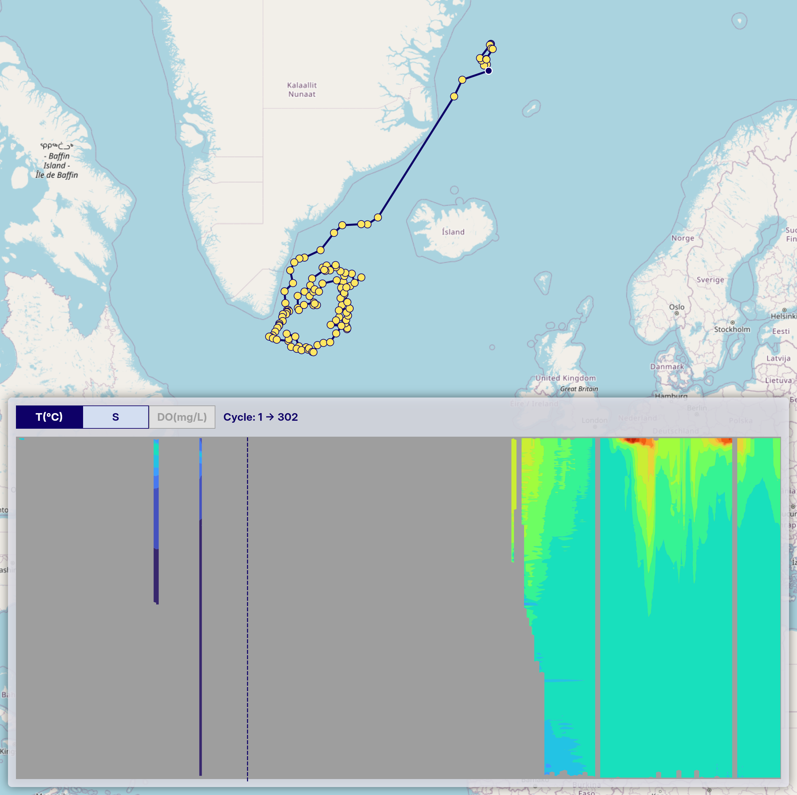

# Limitations

## Missing Values in Vertical Section Charts

1. Masked Areas Without Original Data

    When generating time-series vertical section charts of Argo float data, interpolation (e.g., using scipy.interpolate.griddata) is used to transform irregularly spaced profile data into a regular grid. Some areas may remain unfilled where original profile data are missing. To address this, we apply a mask after gridding to exclude regions without valid observations, setting those values to NaN.

    In the example image below, these masked areas appear as uncolored gaps in the vertical section.

2. Sparse Data Due to Quality Control

    After applying quality control, some profiles may be excluded, resulting in a sparser time series. Even if valid profiles are present at certain time steps, the interpolation process may not be able to generate a continuous vertical section. This leads to sections where observation points exist (trajectory figure) but the interpolated chart shows gray or missing areas (vertical section figure), indicating insufficient data density for interpolation.

    This can be seen in the same image where gray regions appear in the section chart, even though observation points are visible in the trajectory chart above.

    

    Please keep this in mind when interpreting the charts.

3. BGC Parameter Charts May Have More Missing Areas

    Vertical section charts are also available for BGC parameters (chlorophyll, nitrate, backscattering, pH, irradiance, and PAR). Because only a subset of Argo floats carry BGC sensors, BGC data is available for fewer floats overall compared to temperature or salinity. For a section chart of a specific float that does carry a BGC sensor, the number of cycles with BGC data is generally the same as for physical parameters — however, quality control may still cause some individual cycles to be discarded, which can result in gaps.

    Additionally, irradiance and PAR profiles contain data only in the surface layer (roughly 0–200 dbar). Deeper portions of those section charts will always appear as missing areas, which is physically expected behavior.

    Note also that of the two irradiance parameters (`DOWN_IRRADIANCE490` and `DOWNWELLING_PAR`), only PAR is displayed in the OceanGraph interface. Downwelling irradiance at 490 nm is included in downloadable profile data but does not have a corresponding in-app visualization.
