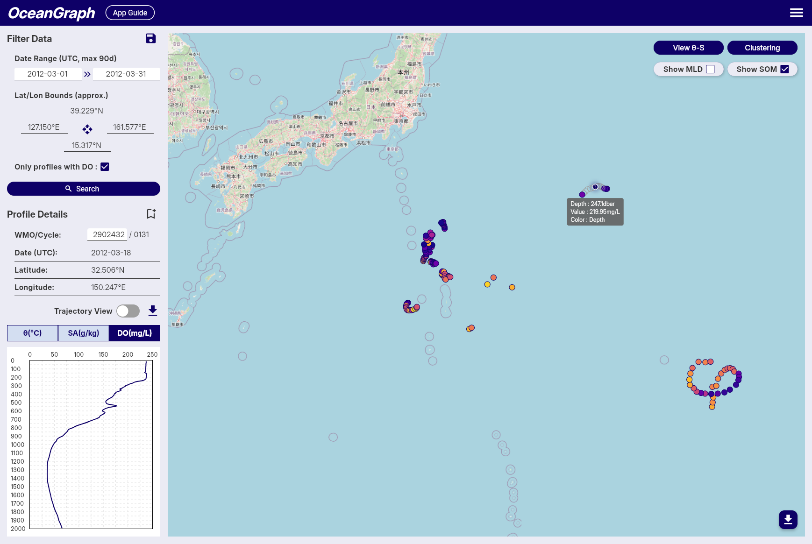

# Dissolved Oxygen Profiles in BGC Argo Explained

When people move beyond temperature and salinity, dissolved oxygen is often the first biogeochemical variable they want to understand. That makes sense. Oxygen adds information about ventilation, near-surface exchange, biological activity, and the history of the water mass that temperature alone cannot provide.

But oxygen profiles can feel harder to interpret at first. Not every Argo float carries oxygen sensors, oxygen coverage can be sparse, and the profile shape is easier to misread if you do not look at temperature and salinity at the same time.

This guide explains what dissolved oxygen profiles in **BGC Argo** data show, how to read the main patterns, what a subsurface oxygen maximum means, common beginner mistakes, and how to find oxygen-bearing profiles in OceanGraph.

If you are completely new to Argo itself, start with [What is Argo Float? A Complete Guide to Ocean Observation Data](./argo-float-complete-guide.md).

## Why Dissolved Oxygen Matters

Dissolved oxygen is useful because it reflects more than one process.

Depending on the region and depth, oxygen structure can be influenced by:

- Contact with the atmosphere
- Surface biological production and consumption
- Ventilation and mixing
- Stratification that isolates subsurface water
- The age and history of a water mass

That means an oxygen profile is not just an extra line on the plot. It can help you distinguish waters that look similar in temperature but have very different recent histories.

This is also why oxygen is best interpreted alongside [Ocean Temperature and Salinity Profiles Explained](./ocean-temperature-and-salinity-profiles-explained.md), not in isolation.

## What BGC Argo Adds to Core Argo

Core Argo focuses on the main physical structure of the ocean, especially temperature and salinity. **BGC Argo** is the subset of the Argo system that carries additional biogeochemical sensors, including dissolved oxygen.

The practical consequence is simple:

- Many Argo profiles contain temperature and salinity
- Fewer Argo profiles contain oxygen
- Oxygen searches usually need a more targeted workflow

That is why OceanGraph includes an **Only profiles with DO** search option. If oxygen is the main scientific question, filtering at the search stage saves time immediately.

If you want the profile-search logic first, see [Finding Argo Float Profiles by Location, Time, and WMO ID](./finding-argo-float-profiles-by-location-time-and-wmo-id.md).

## What a Dissolved Oxygen Profile Usually Shows

Oxygen profiles vary by region and season, so there is no single universal shape. Still, a few patterns appear often enough to give beginners a useful starting point.

### Surface oxygen and recent air-sea contact

Near the surface, oxygen is influenced strongly by contact with the atmosphere and by the recent state of the upper ocean.

Surface values can change with:

- Heating and cooling
- Wind-driven mixing
- Biological activity
- Stratification that limits exchange with deeper water

That is one reason surface oxygen should not be interpreted without location and season.

### Subsurface oxygen maxima

Some profiles show a local oxygen maximum below the immediate surface layer.

This kind of feature often appears in subtropical or tropical settings and can indicate that the upper ocean should not be treated as one uniform layer. A local maximum below the surface may be more informative than the surface value itself.

### Oxygen decline below the upper ocean

Below the well-ventilated upper ocean, dissolved oxygen often decreases.

The exact shape depends on circulation, biological consumption, and water-mass history, but the general lesson is that oxygen structure carries information that temperature and salinity alone do not fully capture.

### Deep structure

At greater depth, oxygen can become relatively stable over thicker layers, or it can continue to vary depending on the region.

The important beginner habit is to read the **shape of the profile**, not only one number.

## Why You Should Read Oxygen Together With Temperature and Salinity

Oxygen interpretation becomes much stronger when it is paired with physical structure.

Temperature and salinity help answer questions such as:

- Is the surface strongly stratified or recently mixed?
- Where is the upper gradient zone?
- Does the oxygen feature sit above, within, or below a strong change in water properties?
- Are two oxygen profiles different because of biology, ventilation, or different water masses?

This is why the most useful workflow is often:

1. Confirm the profile context
2. Read temperature and salinity
3. Read oxygen against the same pressure range
4. Compare multiple cycles or nearby profiles

If you skip the physical context, oxygen patterns are much easier to over-interpret.

## A Practical Example: Reading One Oxygen Profile Step by Step

Imagine you open one BGC Argo profile from a subtropical region.

A practical reading sequence would be:

1. Confirm that the profile includes dissolved oxygen.
2. Check the date, latitude, longitude, WMO ID, and cycle number.
3. Open temperature and salinity first to understand the physical structure.
4. Open the oxygen profile and look for the surface pattern, any local maximum below it, and the deeper trend.
5. Compare with nearby cycles to see whether the oxygen structure is persistent.
6. Use SOM-related output if you want to highlight the subsurface maximum explicitly.

This is much easier when the search and profile views are connected.

Useful OceanGraph pages are:

- [Search and Bookmark](../app-guide/usage-guide/basic-features/search-and-bookmark.md)
- [Vertical Profiles](../app-guide/usage-guide/analysis-lab/vertical-profiles.md)
- [Subsurface Oxygen Maximum (SOM)](../app-guide/usage-guide/basic-features/subsurface-oxygen-maximum.md)

## What Is a Subsurface Oxygen Maximum?

A **subsurface oxygen maximum** is a local maximum of dissolved oxygen found below the immediate surface layer.

In OceanGraph, the SOM is searched for between **mixed layer depth + 5 dbar** and **300 dbar**. The very shallow surface layer is excluded so that transient near-surface effects do not dominate the detection.

The practical idea is important:

- The surface value is not always the most informative oxygen value
- A meaningful oxygen feature may appear just below the mixed layer
- Comparing the depth and value of this maximum across profiles can reveal structure that is hard to see from one glance alone

If multiple local maxima exist, OceanGraph records the one with the highest oxygen concentration. If no local maximum exists, the highest oxygen value within the search range is used as a fallback.

For interpretation, think of SOM as a way to formalize a pattern that your eye might notice in the profile.

## Common Beginner Mistakes

A few oxygen-specific mistakes are common.

### Assuming every Argo float has oxygen

Many floats are core physical floats and do not carry DO sensors. If oxygen is required, filter for oxygen-bearing profiles first.

### Reading oxygen without physical context

An oxygen feature is much easier to misread if you do not also examine temperature, salinity, and upper-ocean structure.

### Treating missing values as meaningful low oxygen

Missing or filtered values are not the same thing as real low-oxygen water. Quality control and sensor availability matter.

### Expecting one universal oxygen shape

Oxygen structure varies strongly with region, season, ventilation, and water-mass history. Do not assume that one pattern seen in one basin should appear everywhere else.

## The Traditional Workflow: Find a BGC Float, Decode the File, Then Plot

A common oxygen workflow looks like this:

1. Find which floats include oxygen
2. Download the relevant files
3. Inspect variable names and QC information
4. Plot oxygen against pressure
5. Repeat with temperature and salinity for context
6. Decide whether a subsurface maximum is real and worth tracking

That workflow is scientifically valid, but it creates a lot of setup work before you have even decided which profiles are worth close attention.

This is similar to the broader problem described in [Visualizing Argo Float Data Without Python (Step-by-Step Guide)](./visualizing-argo-float-data-without-python.md).

## A Better First Step: Filter for Oxygen and Explore Interactively

If your immediate goal is interpretation, OceanGraph is usually the better place to begin.

A practical workflow is:

- Use the dissolved oxygen filter in search
- Inspect the profile context before reading the graph
- Compare oxygen with temperature and salinity
- Check whether a subsurface oxygen maximum appears
- Compare multiple cycles from the same float

That gives you a much clearer idea of which BGC profiles deserve deeper analysis later.

It also keeps the learning sequence in the right order: observation first, file handling later.

## Explore Oxygen-Bearing Argo Profiles in OceanGraph

If you want to move from "which Argo profiles even have oxygen?" to actual oxygen-profile interpretation, OceanGraph is the direct next step.

**[Try with real Argo data -> OceanGraph](https://oceangraph.io/)**

**[Explore profiles interactively](../app-guide/usage-guide/analysis-lab/vertical-profiles.md)**

**[No coding required](https://oceangraph.io/)**

OceanGraph makes it easier to search oxygen-bearing profiles, compare them with physical structure, and inspect subsurface oxygen maxima without building the workflow from scratch.

## Frequently Asked Questions

### Is dissolved oxygen measured in every Argo profile?

No. Dissolved oxygen is mainly available from BGC Argo floats, which are a subset of the overall Argo system.

### What is the difference between core Argo and BGC Argo?

Core Argo focuses on the main physical variables such as temperature and salinity. BGC Argo adds extra biogeochemical sensors, including dissolved oxygen.

### What is a subsurface oxygen maximum?

It is a local maximum of dissolved oxygen below the immediate surface layer. In OceanGraph, SOM is searched within a subsurface range tied to the mixed layer depth.

### Why do oxygen profiles often have more gaps than temperature or salinity?

Because fewer floats carry oxygen sensors, and quality control can remove some values. So oxygen coverage is often sparser than core physical coverage.

### Do I need Python before I can start reading oxygen profiles?

No. Python is useful for custom and reproducible analysis, but it does not have to be step zero if your goal is first-pass interpretation.

## Conclusion

Dissolved oxygen profiles are one of the most useful first steps into BGC Argo because they add history and process information that temperature and salinity alone cannot fully show. The main challenge is that oxygen needs more context: not every float has it, and the profile is much easier to misread if you ignore the physical structure around it.

For many learners, the better path is to filter for oxygen-bearing profiles, compare them interactively, and only then move to a heavier analysis workflow. That is where [OceanGraph](https://oceangraph.io/) is especially useful.
