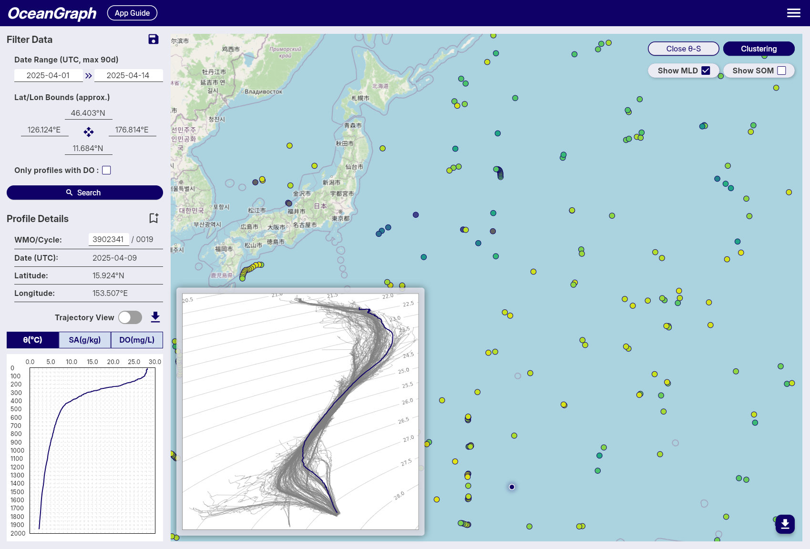

# Making a T-S Diagram: Python vs Interactive Tools

If you search for **how to make a T-S diagram**, you will usually find code examples first. That makes sense because a T-S diagram is a classic oceanographic plot, and Python is a common way to generate it. But for many learners, researchers, and students, the real need is not "how do I write plotting code?" It is **how do I get to a usable T-S diagram quickly enough to understand the water structure?**

That is an important distinction. Making a T-S diagram is not only a programming task. It is also an interpretation workflow. You need the right data, the right context, and a sensible path from search to profile comparison to property-space interpretation.

This guide compares two practical ways to make a T-S diagram:

- The traditional **Python workflow**
- The **interactive tool workflow** using OceanGraph

It explains what each path requires, where each one is strong, and why an interactive workflow is often the better first step when your goal is understanding rather than batch processing.

If you want to understand how to read the finished plot, pair this article with [T-S Diagrams in Oceanography Explained (With Examples)](./ts-diagrams-in-oceanography-explained.md).

## Why People Search for Ways to Make a T-S Diagram

The search intent behind this topic is usually one of these:

- You have Argo or CTD profile data and need a T-S plot
- You are trying to identify water masses
- You want to compare several profiles in one view
- You need a T-S figure for class, screening, or early analysis
- You want to understand ocean structure before building a heavier workflow

In other words, the need is usually practical. People are not asking for a T-S diagram because they like plots in the abstract. They are asking because they want to answer physical questions about the ocean.

That means the best workflow is not always the one with the most code. It is the one that gets you from data to interpretation with the least unnecessary friction.

## What You Need Before Making a T-S Diagram

No matter which workflow you use, the basic ingredients are similar.

You need:

- Profile data with temperature and salinity information
- Enough context to know where and when the profile was collected
- A way to compare one profile or multiple profiles
- A clear reason for looking in T-S space rather than depth space alone

In practice, it also helps to understand the profile first. If you have not yet done that, [How to Read Argo Float Data for Beginners (What to Look at First)](./how-to-read-argo-float-data.md) and [Ocean Temperature and Salinity Profiles Explained](./ocean-temperature-and-salinity-profiles-explained.md) are useful preparation.

For interpretation, remember that a T-S diagram is often a θ-S diagram in modern tools. OceanGraph uses a [θ-S Diagram](../app-guide/usage-guide/basic-features/t-s-diagram.md), which is the same core idea in a more analysis-friendly form.

## The Python Workflow

Python is a powerful way to make a T-S diagram, especially if you need full control.

### Downloading the data

The first step is usually to obtain the relevant profile data.

That may mean:

- Downloading Argo profile files
- Selecting a float by WMO ID
- Narrowing the data by region or date
- Deciding whether one profile or many profiles should be included

This step already requires judgment. If you choose the wrong profiles, even a technically correct T-S diagram will not answer your real question.

### Reading NetCDF files

Once you have the files, you need to open them and identify the variables you actually want to plot.

In a Python workflow, that usually means working with:

- NetCDF structures
- Array dimensions
- Metadata conventions
- Quality information

At this point, many beginners discover that the hard part is not drawing the plot. It is understanding the data structure well enough to prepare the plot correctly.

### Cleaning temperature and salinity values

Before plotting, you often need to decide:

- Which temperature variable to use
- Which salinity variable to use
- Whether to apply quality filtering
- How to handle missing values
- Whether to convert to potential temperature or other derived quantities

These are important scientific choices, but they also add setup time before you can inspect even one figure.

### Plotting the diagram

Only after the preparation do you reach the actual plotting step.

Now you can:

- Put salinity on the horizontal axis
- Put temperature or potential temperature on the vertical axis
- Plot one profile or many profiles
- Add density contours if needed
- Adjust labels, ranges, and styling

This is powerful because it is flexible. But it also means the workflow is only as smooth as your data handling and plotting code.

## Where the Python Workflow Becomes Heavy for Beginners

Python is not the problem. The timing is.

For many users, Python becomes heavy when it is forced to be **step zero**.

Common friction points include:

- You spend time installing packages before seeing one diagram
- You need to decode NetCDF structure before you know whether the profile is useful
- You are forced to choose variables before you have visual intuition
- Comparing several profiles requires more code, not less
- Debugging becomes the main task instead of interpretation

That is why many people searching for `ts diagram python` are actually looking for a shorter path to insight.

## The Interactive Workflow

An interactive workflow flips the order. Instead of preparing code first, you inspect the data first.

### Search for a float or profile

Start by narrowing the profiles you care about.

In OceanGraph, this means using the search workflow to filter by:

- Region
- Date range
- WMO ID
- Available profile characteristics

The search entry point is here:

- [Search and Bookmark](../app-guide/usage-guide/basic-features/search-and-bookmark.md)

This matters because a useful T-S diagram begins with a sensible selection of profiles.

### Open the T-S view

Once the search results are in place, you can open the θ-S diagram view.

OceanGraph generates the diagram from the current search area, which means the T-S view stays connected to the actual profile set you are exploring rather than being detached from context.

The feature overview is here:

- [θ-S Diagram](../app-guide/usage-guide/basic-features/t-s-diagram.md)

This is often the fastest way to move from "I found some profiles" to "I can see the temperature-salinity structure."

### Compare profiles without writing code

The real strength of an interactive workflow is not just speed. It is that profile context and interpretation stay together.

In OceanGraph, you can:

- Search for relevant profiles
- Read the vertical profile first
- Open the θ-S view second
- Compare selected profiles against the broader background distribution

That sequence is important because it matches the scientific logic of interpretation.

If you want the no-code exploration workflow in more detail, see [Visualizing Argo Float Data Without Python (Step-by-Step Guide)](./visualizing-argo-float-data-without-python.md).

## Python vs Interactive Tools: A Practical Comparison

The best workflow depends on what you are trying to do.

| Question | Python workflow | Interactive workflow |
| --- | --- | --- |
| Time to first diagram | Slower | Faster |
| Setup required | Higher | Lower |
| Control over plotting details | Very high | Moderate |
| Best for screening profiles | Less convenient | Very convenient |
| Best for batch processing | Strong | Limited |
| Best for teaching or first interpretation | Often heavier | Strong |
| Best for final custom analysis | Strong | Usually a first step |

The practical takeaway is simple:

- Use **interactive tools first** when your goal is understanding, screening, or selecting cases
- Use **Python later** when your goal is automation, customization, or reproducible large-scale analysis

## When Python Is Still the Right Choice

Python remains the better option when you need to:

- Process many profiles in bulk
- Reproduce a figure exactly in a script
- Add custom derived calculations
- Merge Argo data with other datasets
- Generate publication-ready plots in a controlled pipeline

If you already know which profiles matter and what you want to compute, Python becomes more efficient.

The key point is that Python is strongest **after the question is clear**, not always before.

## When an Interactive Tool Is the Better First Step

An interactive tool is often the better first step when:

- You are learning how T-S diagrams work
- You want to inspect real data quickly
- You are screening profiles before deeper analysis
- You need to compare observations without building a full code workflow
- You want to connect the T-S view directly to the vertical profile and search context

This is especially useful for students, early-career researchers, and collaborators who need to understand the data before they formalize an analysis pipeline.

## Example Workflow: From First Look to Deeper Analysis

A pragmatic workflow often looks like this:

1. Search for profiles in OceanGraph by region, date, or WMO ID.
2. Check the observation context.
3. Open the vertical profiles and identify which cases are interesting.
4. Open the θ-S diagram to examine the property-space structure.
5. Compare profiles and note which ones show distinct layering, clustering, or mixing-like behavior.
6. Return to Python later only for the subset that deserves custom analysis.

This workflow is efficient because it uses the right tool at each stage.

Instead of writing code to inspect many uncertain candidates, you use interactive exploration to narrow the problem first. Then Python becomes a focused analysis tool rather than a discovery bottleneck.

OceanGraph's related pages for this workflow are:

- [Search and Bookmark](../app-guide/usage-guide/basic-features/search-and-bookmark.md)
- [Vertical Profiles](../app-guide/usage-guide/analysis-lab/vertical-profiles.md)
- [θ-S Diagram](../app-guide/usage-guide/basic-features/t-s-diagram.md)
- [T-S Diagrams in Oceanography Explained (With Examples)](./ts-diagrams-in-oceanography-explained.md)

## Try a T-S Diagram in OceanGraph

If your goal is to understand water structure rather than spend the first hour building a plotting environment, the faster next step is to open a real θ-S view directly.

**[Try with real Argo data -> OceanGraph](https://oceangraph.io/)**

**[Explore profiles interactively](../app-guide/usage-guide/basic-features/t-s-diagram.md)**

**[No coding required](https://oceangraph.io/)**

OceanGraph is useful as the first step in the workflow: search, inspect, compare, then decide whether custom code is actually needed.

## Frequently Asked Questions

### Is a T-S diagram the same as a θ-S diagram?

They are closely related. A classic T-S diagram uses temperature and salinity, while a θ-S diagram typically uses potential temperature and absolute salinity. For practical interpretation, the core idea is the same.

### Do I need Python to make a T-S diagram?

No. Python is useful for custom plotting and automation, but it is not required if your immediate goal is to inspect real profile structure interactively.

### When should I switch from an interactive tool to Python?

Switch when you already know which profiles matter and you need reproducible batch processing, custom calculations, or publication-style control over the output.

### Can I compare more than one profile without writing code?

Yes. That is one of the main advantages of an interactive workflow. It lets you compare profile structure without building plotting scripts first.

### Is the interactive route only for beginners?

No. It is especially helpful for beginners, but it is also useful for experienced users who want to screen profiles quickly before deeper scripted analysis.

## Conclusion

There is no single correct way to make a T-S diagram. The right choice depends on the stage of your work. If you need complete control, automation, or reproducibility at scale, Python is the right tool. If you need to understand the data quickly, compare profiles, and build intuition before coding, an interactive workflow is often the better first step.

That is the role [OceanGraph](https://oceangraph.io/) can play. It helps you reach a usable θ-S view quickly, so code becomes a deliberate next step rather than an immediate barrier.
