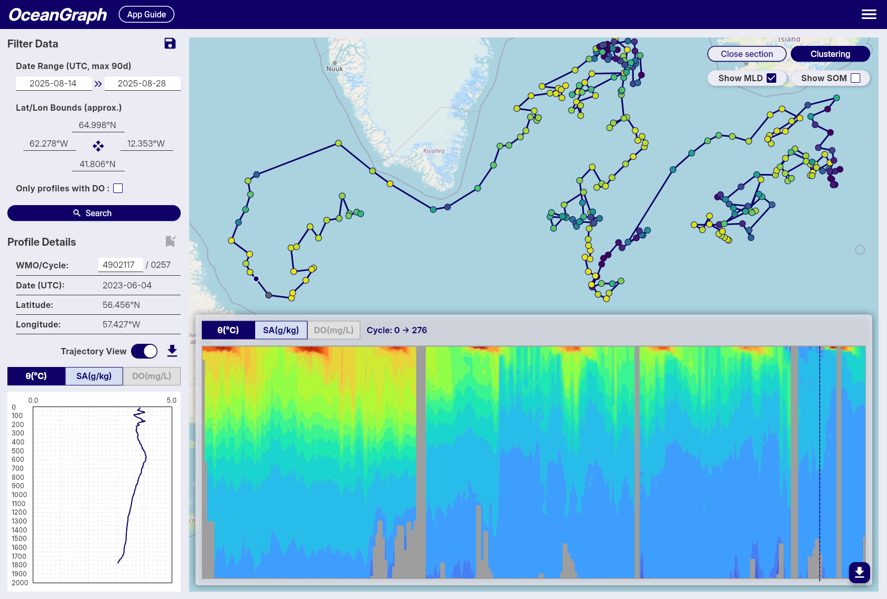

# Ocean Data Visualization: Methods, Examples, and Tools

When people search for **ocean data visualization**, they are usually not looking for a generic chart tutorial. They want to understand what kind of plots oceanographers actually use, what each view reveals, and how to move from raw measurements to something scientifically interpretable.

That need is reasonable because ocean data is harder to visualize than many other datasets. It changes across **space**, **time**, and **depth**, and the important patterns are often hidden unless you choose the right view. A surface map alone is not enough. A profile alone is not enough. A table of values is almost never enough.

This guide explains the main methods used in ocean data visualization, what each one is good for, where beginners often get stuck, and how to explore real Argo-based examples in OceanGraph before building a heavier coding workflow.

If you want a dataset-centered introduction first, start with [What is Argo Float? A Complete Guide to Ocean Observation Data](./argo-float-complete-guide.md).

## Why Ocean Data Visualization Matters

Ocean data is difficult to interpret in raw form because the ocean is a three-dimensional, time-varying system.

Even a simple question such as "what is the water like here?" can mean several different things:

- What does the surface look like on a map?
- How do temperature and salinity change with depth?
- How does one location evolve over time?
- Are two profiles part of the same water mass structure?
- Is a feature local, regional, seasonal, or persistent?

Visualization matters because each plot answers a different version of that question.

A good visualization should help you:

- Identify the right spatial and temporal context
- Recognize vertical structure instead of isolated values
- Compare multiple profiles or regions efficiently
- See relationships between variables, not only single-variable behavior
- Decide which observations are worth deeper analysis later

In practice, ocean data visualization is not one method. It is a small set of complementary views.

## The Main Types of Ocean Data Visualization

Different plots are useful for different scientific questions. The most common types are:

- Map views
- Vertical profiles
- Trajectories and time-series sections
- Temperature-salinity diagrams
- Time series

The important point is not to ask which one is "best." The better question is which one best matches the question you are trying to answer.

## 1. Map Views: Where Is the Data?

A map is often the first place to start because it gives the observation context.

Map views help you answer:

- Which ocean basin or region am I looking at?
- Is the observation coastal or open ocean?
- How far apart are the profiles?
- Are the data clustered in one area or spread across a wider region?

This is especially important for Argo data. The same type of profile can mean different things depending on whether it comes from a subtropical gyre, a western boundary current region, or a high-latitude ocean.

Map views are strong for orientation, but weak for vertical interpretation. They tell you where the observation is, not what the water column looks like below the surface.

That is why they are usually the first step, not the last one.

## 2. Vertical Profiles: What Does the Water Column Look Like?

A **vertical profile** plots one variable such as temperature, salinity, or oxygen against pressure or depth.

This is one of the most fundamental forms of ocean data visualization because it makes the vertical structure visible.

Profiles help you recognize:

- Surface layers
- Mixed layers
- Thermoclines and haloclines
- Subsurface maxima or minima
- Stable deep structure

If you are new to profile interpretation, [Ocean Temperature and Salinity Profiles Explained](./ocean-temperature-and-salinity-profiles-explained.md) is the best companion article.

The strength of a profile is clarity. You can see where the major transitions occur in the water column. The limitation is that a single profile does not always show how the structure changes in space or time unless you compare it with other profiles.

## 3. Trajectories and Time-Series Sections: How Does Structure Change Along a Path or Over Time?

Some questions are not about one profile. They are about change.

That is where **trajectory views** and **time-series vertical sections** become useful.

A trajectory view helps you see:

- Where a float moved over multiple cycles
- Whether nearby profiles are actually part of one continuous path
- How the observation sequence relates to geographic setting

A time-series or section-like view helps you see:

- How temperature, salinity, or oxygen change over repeated profiles
- Whether a feature is persistent or short-lived
- Whether surface variability differs from deeper structure

This kind of visualization is often more informative than opening profiles one by one in isolation.

OceanGraph supports this workflow here:

- [Trajectory and Time-Series Vertical Section](../app-guide/usage-guide/basic-features/trajectory-and-time-series-vertical-section.md)

## 4. Temperature-Salinity Diagrams: What Kind of Water Is This?

A **T-S diagram** or **θ-S diagram** is one of the most useful diagnostic plots in physical oceanography.

Instead of showing how one variable changes with depth, it shows how **temperature** and **salinity** occur together. This makes it easier to identify:

- Water masses
- Mixing-like relationships
- Density-related structure
- Differences that are hard to see from one variable alone

If vertical profiles tell you where a transition happens, a T-S view helps tell you what kind of water the transition represents.

If you want a beginner-friendly interpretation guide, see [T-S Diagrams in Oceanography Explained (With Examples)](./ts-diagrams-in-oceanography-explained.md).

## 5. Time Series: How Does One Variable Evolve at One Place or One Platform?

A time series is useful when the primary question is temporal variability.

This can mean:

- How a float's observations change cycle by cycle
- How one parameter evolves seasonally
- Whether a feature is recurring or unusual

Time series are powerful when you already know which variable and location matter. They are less effective as a first-pass overview if you have not yet decided which profiles are important.

That is why many learners benefit from seeing map context and vertical structure before narrowing to a time series.

## A Practical Example: One Question, Several Views

Imagine you want to understand whether a set of profiles in the subtropical ocean shows a stable deep structure but variable upper-ocean conditions.

You would not answer that well with only one visualization.

A practical workflow would look like this:

1. Use a map to confirm the region and the observation path.
2. Open trajectories to see whether the profiles come from one float over time.
3. Compare vertical profiles to inspect the surface layer, main gradients, and deeper water.
4. Open a θ-S diagram to see whether the deeper water remains compact while the upper layer spreads more broadly.
5. Use a time-series section to see whether the upper-ocean variability changes cycle by cycle.

This is what good ocean data visualization really means: not choosing a single plot, but choosing the right sequence of views.

## Common Ocean Data Visualization Methods and Their Tradeoffs

In practice, most people use one of four routes.

### Static figures in papers or slides

These are useful for communication and summary.

Advantages:

- Clear for presenting a final result
- Easy to annotate
- Familiar in teaching and publications

Limitations:

- Not interactive
- Hard to inspect underlying context
- Often disconnected from the raw observation workflow

### Python notebooks and scripts

This is the standard route for custom analysis.

Advantages:

- Flexible
- Reproducible
- Good for batch analysis and publication-quality workflows

Limitations:

- Requires setup before interpretation
- Raw file handling can slow the first stage of learning
- Small comparison tasks still take code

### GIS or map-focused tools

These are strong when the primary goal is spatial context.

Advantages:

- Excellent for geographic patterns
- Useful for regional overview

Limitations:

- Often weak for profile-by-profile interpretation
- Less natural for water-column analysis

### Interactive scientific viewers

These are useful when you want to explore before coding deeply.

Advantages:

- Faster first-pass interpretation
- Easier profile comparison
- Better for teaching and hypothesis-building

Limitations:

- Less customizable than full coding workflows
- Not always enough for final analysis products

The right choice depends on the stage of work. Exploration, screening, teaching, and intuition-building often benefit from interactivity. Final statistics or custom figures often still need code.

## Why Beginners Often Struggle With Ocean Data Visualization

Most beginners do not struggle because the ocean is impossible to understand. They struggle because too much cognitive load appears too early.

Typical problems include:

- The first file they open is a NetCDF file instead of a plot
- They see variable names before they see physical structure
- They work on figure code before they understand which question matters
- They compare only one profile at a time
- They separate map context from vertical interpretation

This makes the workflow feel more technical than scientific.

The better sequence is usually:

1. Start with observation context
2. Inspect the vertical structure
3. Compare multiple profiles
4. Use a diagnostic plot such as θ-S when needed
5. Move to code only after the interesting cases are clear

## OceanGraph Workflow: A Practical First Step

OceanGraph is useful because it keeps several important visualization modes close together.

With OceanGraph, you can:

- Search real Argo profiles by region, time, and WMO ID
- Keep geographic and cycle context visible
- Inspect trajectories and time-series sections
- Open vertical profiles interactively
- View θ-S structure without building the plot manually

Useful entry points are:

- [Search and Bookmark](../app-guide/usage-guide/basic-features/search-and-bookmark.md)
- [Trajectory and Time-Series Vertical Section](../app-guide/usage-guide/basic-features/trajectory-and-time-series-vertical-section.md)
- [Vertical Profiles](../app-guide/usage-guide/analysis-lab/vertical-profiles.md)
- [θ-S Diagram](../app-guide/usage-guide/basic-features/t-s-diagram.md)

If your immediate goal is to understand the data rather than to automate a full pipeline, this is often the better first step.

## Explore Ocean Data in OceanGraph

If you want to move from abstract plotting ideas to real Argo-based ocean data visualization, the next step is to open actual observations and compare several views together.

**[Try with real Argo data -> OceanGraph](https://oceangraph.io/)**

**[Explore profiles interactively](../app-guide/usage-guide/analysis-lab/vertical-profiles.md)**

**[No coding required](https://oceangraph.io/)**

OceanGraph makes it easier to connect maps, profiles, sections, and θ-S interpretation in one workflow.

## Frequently Asked Questions

### What is the most useful first plot for ocean data?

Usually a map plus a vertical profile. The map provides location context, and the profile reveals the water-column structure.

### Is ocean data visualization only for physical oceanography?

No. The same logic applies to many parameters, including oxygen and other biogeochemical variables. The key is still choosing the view that matches the question.

### Why is a surface map not enough?

Because important ocean structure is vertical. Two places with similar surface conditions can have very different profiles below the surface.

### Do I need Python before I can start visualizing ocean data?

No. Python is useful for custom and reproducible analysis, but it does not have to be step zero if your goal is first-pass understanding.

### Why use several visualization types instead of one?

Because each plot answers a different question. Maps provide location context, profiles show vertical structure, sections show change, and θ-S diagrams show relationships between water properties.

## Conclusion

Ocean data visualization works best when it is treated as a sequence of complementary views rather than a single plotting task. Maps, profiles, sections, and θ-S diagrams each reveal different parts of the same system.

For many learners and early-stage projects, the fastest path is to explore those views interactively before investing in a heavier workflow. That is where [OceanGraph](https://oceangraph.io/) becomes useful.
