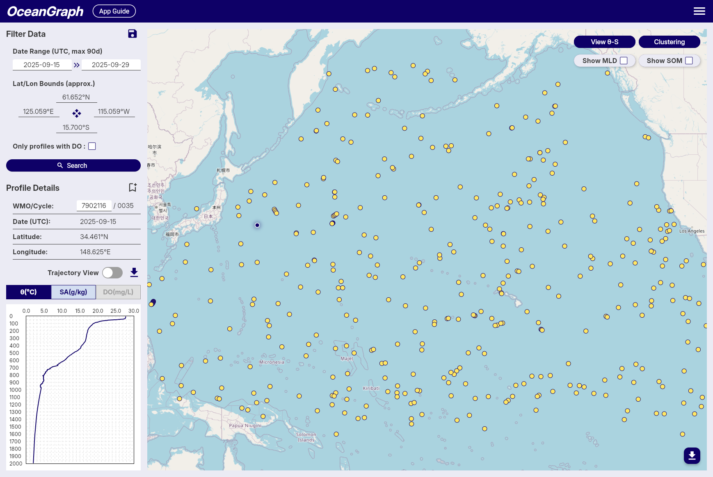
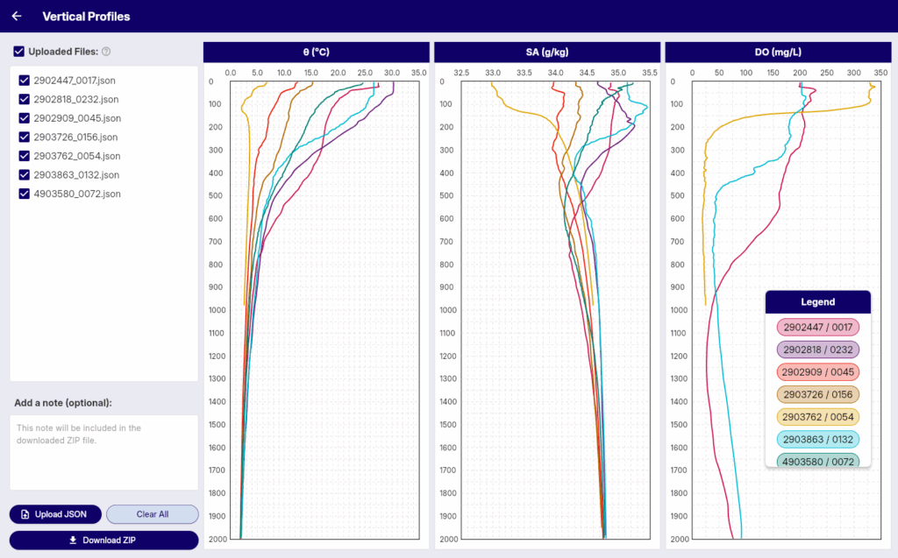

# Visualizing Argo Float Data Without Python (Step-by-Step Guide)

If you want to explore **Argo float data** but do not want to start with Python, you are not alone. Many students, early-career researchers, and domain learners reach the same point: they are interested in the ocean, but the first barrier they hit is not science. It is tooling.

Raw Argo files are powerful, but they are not beginner-friendly. You often need to download NetCDF files, inspect variable names, handle quality flags, and write plotting code before you can even look at one profile clearly.

This guide shows **how to visualize Argo float data without Python**, step by step. It explains what you usually need to see first, why the traditional workflow can slow learning down, and how to explore real Argo profiles in **OceanGraph** with no coding required.

If you are completely new to Argo itself, start with [What is Argo Float? A Complete Guide to Ocean Observation Data](./argo-float-complete-guide.md).

## Why People Search for "Argo Without Python"

The intent behind this search is usually practical, not theoretical.

Most people are trying to do one of these things:

- Open real Argo profiles and see temperature or salinity against depth
- Compare several profiles from the same float or region
- Understand what the data looks like before building an analysis workflow
- Check whether a float or profile is relevant to a research question
- Learn ocean structure without spending the first hour debugging code

That is a sensible workflow. In many cases, visual exploration should come before scripting.

## What You Usually Want to Visualize First

Before doing full Argo float data analysis, most beginners need only a few core views:

- A **map view** to see where the float or profiles are located
- A **time and cycle view** to understand when the measurements were taken
- A **vertical profile** view for temperature, salinity, or oxygen against depth
- A **T-S or θ-S view** to understand the relationship between water properties

Those views answer the first important questions:

- Where is the float?
- When was the profile collected?
- What does the water column look like?
- How does one profile compare with another?
- Are there different water masses or mixing-like patterns?

If you can answer those visually, you are already much closer to meaningful analysis.

## Why the Traditional Workflow Feels Heavy

The standard route for Argo visualization often looks like this:

1. Download Argo files.
2. Open them in Python.
3. Load NetCDF variables with the right libraries.
4. Inspect metadata and quality flags.
5. Extract pressure, temperature, and salinity.
6. Write plotting code.
7. Adjust axes, units, and labels.
8. Repeat for the next profile.

That workflow is completely valid for custom research. But it is not always the best first step.

For many learners, the real problem is that they want to understand the ocean, while the workflow forces them to solve a software setup problem first.

Typical friction points are:

- You need Python packages before you know whether the profile is even useful
- NetCDF structure can feel unfamiliar if you are new to scientific data files
- Variable names and QC flags require interpretation
- Simple comparison plots still take code
- It is easy to spend more time preparing figures than reading them

This is exactly why a no-code visualization path is useful.

## A Simpler Alternative: Visualize First, Code Later

If your immediate goal is to explore Argo data, the faster approach is:

1. Search for relevant profiles
2. Inspect them visually
3. Compare locations, dates, and cycles
4. Build intuition about the structure
5. Decide whether deeper analysis is worth coding later

OceanGraph is designed for that stage.

With OceanGraph, you can:

- Search Argo profiles by region, time, and WMO ID
- View trajectories and profile locations
- Explore vertical profiles interactively
- Inspect θ-S structure without generating plots manually

In other words, it lets you start from interpretation instead of file handling.

## Step-by-Step Workflow for Visualizing Argo Float Data Without Python

Here is a practical workflow you can follow.

### Step 1. Open OceanGraph and start with a search

Begin in OceanGraph's search interface and define the rough scope of the data you want to inspect.

Common starting filters include:

- Date range
- Geographic region
- A known WMO ID if you already have a specific float
- Dissolved oxygen availability if you need BGC-related profiles

The search workflow is described here:

- [Search and Bookmark](../app-guide/usage-guide/basic-features/search-and-bookmark.md)

At this stage, do not try to be too precise. Start broad enough to see what is available, then narrow the search after you recognize the profile patterns you care about.

### Step 2. Check profile context before reading the graph

Once search results appear, inspect the profile metadata first:

- WMO ID
- Cycle number
- Date
- Latitude and longitude

This matters because a graph is easier to interpret when you know whether you are looking at:

- One float over time
- Several floats in the same region
- A seasonal window
- A specific event or transect-like sequence

Many interpretation mistakes happen when users jump straight to the plot without this context.

### Step 3. Open vertical profiles

The next step is usually the most important one: inspect the **vertical profile**.

This is where you can quickly see:

- Surface structure
- Mixed layers
- Sharp gradients
- Subsurface maxima or minima
- Deep-water stability

OceanGraph's profile viewer is here:

- [Vertical Profiles](../app-guide/usage-guide/analysis-lab/vertical-profiles.md)

For first-pass interpretation, focus on just a few questions:

- Is the surface warm or cool relative to deeper water?
- Does salinity change gradually or in layers?
- Are there obvious transitions that suggest different water masses?
- Do nearby cycles look similar or different?

That gives you more practical understanding than a raw file listing ever will.

### Step 4. Compare more than one profile

One profile is useful. Two or more profiles are usually much better.

A good no-code workflow is to compare:

- Different cycles from the same float
- Nearby profiles from the same region
- Similar dates in different locations

This helps you separate:

- Stable deep structure
- Variable upper-ocean conditions
- Persistent regional patterns
- Short-term changes

If you are learning Argo data analysis, this comparison step is where your intuition starts to become transferable.

### Step 5. Use a θ-S diagram when depth plots are not enough

A vertical profile tells you how one variable changes with depth. A **θ-S diagram** helps you understand how temperature and salinity combine.

This is especially useful when you want to:

- Identify water-mass structure
- Compare profiles in property space
- Recognize mixing-like transitions
- Understand why two profiles that look similar in one variable may still differ physically

OceanGraph includes a dedicated guide here:

- [θ-S Diagram](../app-guide/usage-guide/basic-features/t-s-diagram.md)
- [T-S Diagrams in Oceanography Explained (With Examples)](./ts-diagrams-in-oceanography-explained.md)

For many beginners, this is the point where Argo data stops feeling like a spreadsheet and starts feeling like physical oceanography.

### Step 6. Save or bookmark the profiles worth deeper analysis

Not every profile you inspect needs immediate coding.

A more efficient workflow is:

1. Explore visually first
2. Bookmark the profiles that look interesting
3. Return later with Python only when you have a clearer question

That means your coding time is spent on analysis that matters, not on opening random files just to decide whether they are relevant.

## When No-Code Visualization Is the Better Choice

Visualizing Argo float data without Python is especially useful when:

- You are learning Argo for the first time
- You want to screen profiles before writing analysis scripts
- You are teaching or demonstrating ocean profile structure
- You need a fast view of temperature, salinity, or oxygen behavior
- You are working with collaborators who do not use coding workflows

This does **not** mean Python is unnecessary. It means Python is often more useful after you already know what you want to analyze.

## When You Will Still Want Python Later

Eventually, code becomes important if you need to:

- Process many profiles in bulk
- Apply reproducible filters or statistics
- Merge Argo data with other datasets
- Build publication figures programmatically
- Run derived calculations beyond the built-in visual workflow

The key idea is not "never use Python."

It is "do not force Python to be step zero if your immediate need is visual understanding."

## OceanGraph Workflow Summary

If your goal is to visualize Argo float data without Python, the simplest workflow is:

1. Search real profiles in OceanGraph
2. Check date, location, WMO ID, and cycle context
3. Read the vertical profile first
4. Compare multiple profiles
5. Use the θ-S diagram when you need water-mass interpretation
6. Bookmark the profiles worth deeper study

That is enough to move from raw curiosity to informed observation without touching a script.

## Try It in OceanGraph

If you want to stop dealing with file format friction and start looking at real ocean structure, OceanGraph is the direct next step.

**[Try with real Argo data -> OceanGraph](https://oceangraph.io/)**

**[Explore profiles interactively](../app-guide/usage-guide/analysis-lab/vertical-profiles.md)**

**[No coding required](https://oceangraph.io/)**

OceanGraph helps bridge the gap between searching for "how to visualize Argo float data without Python" and actually doing it.

## Frequently Asked Questions

### Can I really work with Argo data without Python?

Yes, for visual exploration and early interpretation. If your goal is to inspect real profiles, compare them, and understand their structure, a no-code tool can be enough for the first stage.

### What is the easiest first graph to look at?

A vertical profile of temperature or salinity against depth. It is the fastest way to understand the structure of one observation.

### Do I need to understand NetCDF before visualizing Argo data?

No. NetCDF knowledge becomes useful later, but it does not need to be the first step if you only want to explore the data visually.

### Is OceanGraph only for beginners?

No. It is especially useful for beginners, but it is also practical for researchers who want to screen profiles, compare observations quickly, or identify interesting cases before deeper analysis.

### What should I read next after this guide?

These are the most useful follow-up pages:

- [What is Argo Float? A Complete Guide to Ocean Observation Data](./argo-float-complete-guide.md)
- [T-S Diagrams in Oceanography Explained (With Examples)](./ts-diagrams-in-oceanography-explained.md)
- [Search and Bookmark](../app-guide/usage-guide/basic-features/search-and-bookmark.md)
- [Vertical Profiles](../app-guide/usage-guide/analysis-lab/vertical-profiles.md)

## Conclusion

The hardest part of Argo data is often not the science. It is the tooling that sits in front of the science.

If you are trying to learn, screen, or interpret profiles, you do not have to start with Python. A no-code workflow lets you begin with the questions that actually matter: where the profile was collected, what the water column looks like, and how different profiles compare.

That is the role [OceanGraph](https://oceangraph.io/) can play. It helps you visualize Argo float data first, then move to coding later when you have a clearer analytical purpose.
