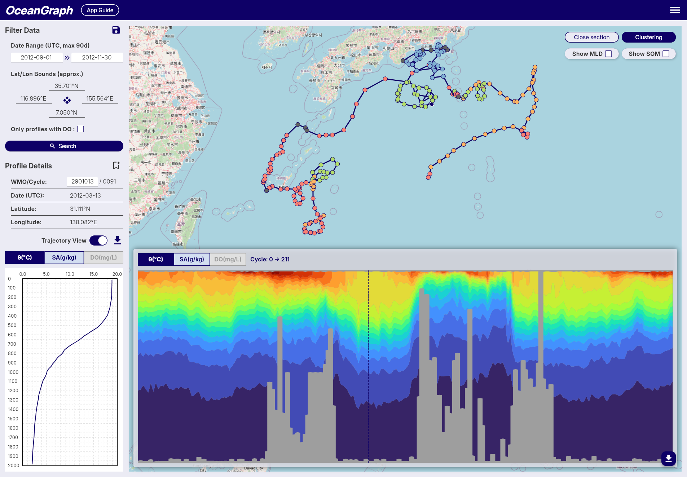

# Exploring Argo Data Before You Write Code

OceanGraph helps you explore Argo float data before you start writing code.

When you begin oceanographic research, you are often told to “look at the data,”
but it is not always clear what to look for or how to interpret what you see.

OceanGraph is a web-based visualization platform that lets you interactively browse Argo float profiles, trajectories, and T-S diagrams, helping you build intuition and research questions without dealing with NetCDF files or complex scripts.

With OceanGraph, you can:

- Compare vertical profiles across locations and time
- Examine water mass characteristics using T-S diagrams
- Trace float trajectories to understand spatial context
- Identify patterns and anomalies that may lead to research questions

OceanGraph is not a replacement for numerical analysis or scripting.
It is designed to support early-stage exploration and interpretation, not to produce final results for publication.

