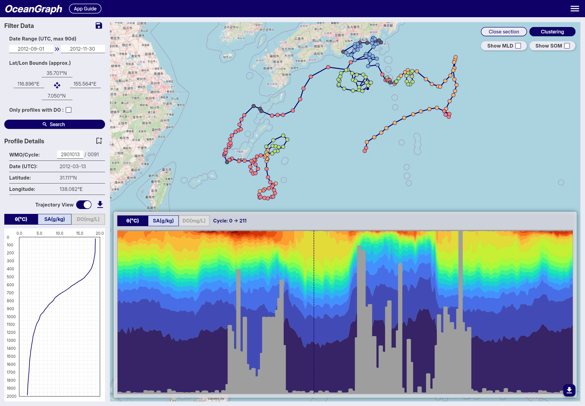

# Clustering

OceanGraph provides a beta feature that clusters Argo profiles based on their vertical structure using machine learning. This functionality is experimental and comes with the following limitations and processing steps:

1. Profile Limit

   - To reduce server load and memory usage, clustering accepts a maximum of 500 valid profiles per job.

2. Depth Range & Interpolation

   - The depth range used for clustering is dynamically determined based on the input profiles:
     - **Minimum depth**: Fixed at 200 dbar to suppress the effects of seasonal thermocline and surface forcing.
     - **Maximum depth**: Automatically set to the 25th percentile of maximum depths across all valid profiles, then rounded down to the nearest 100 dbar increment.
     - The maximum depth is capped at 1000 dbar and will not go below the minimum depth of 200 dbar.
   - If most of the selected profiles are shallow, the maximum depth threshold is adjusted downward to maximize data utilization.
   - Profiles are linearly interpolated every 100 dbar within this determined range to align them on a common vertical grid.
   - This adaptive approach ensures optimal clustering performance regardless of the depth characteristics of the selected profiles.

3. Required Variables

   - Only profiles containing valid temperature and salinity data are considered.
   - Profiles missing these variables or lacking coverage in the specified depth range are excluded.

4. Clustering Feature Vector

   - Clustering is based on a feature vector composed of interpolated temperature and salinity values, combined with location data.
   - Temperature and salinity vectors are standardized using z-score normalization at each depth level to ensure that variations at all depths contribute equally to the clustering process.
   - Latitude is included as an additional feature, normalized by linear scaling from -90 to 90 degrees into a range of -1 to 1.
   - Longitude is transformed into two features using its sine and cosine values (i.e., sin(λ), cos(λ)), allowing for circular continuity around the ±180° meridian without further normalization.

5. Automatic K Determination

   - The number of clusters (K) is selected automatically using a simplified elbow method (with a maximum of 8 clusters).

This feature is available to **signed-in users only**. While we are actively improving this system, unexpected results or limitations may occur. We appreciate your understanding during this beta period.

**Note:** Gray markers indicate profiles that were excluded from clustering.
