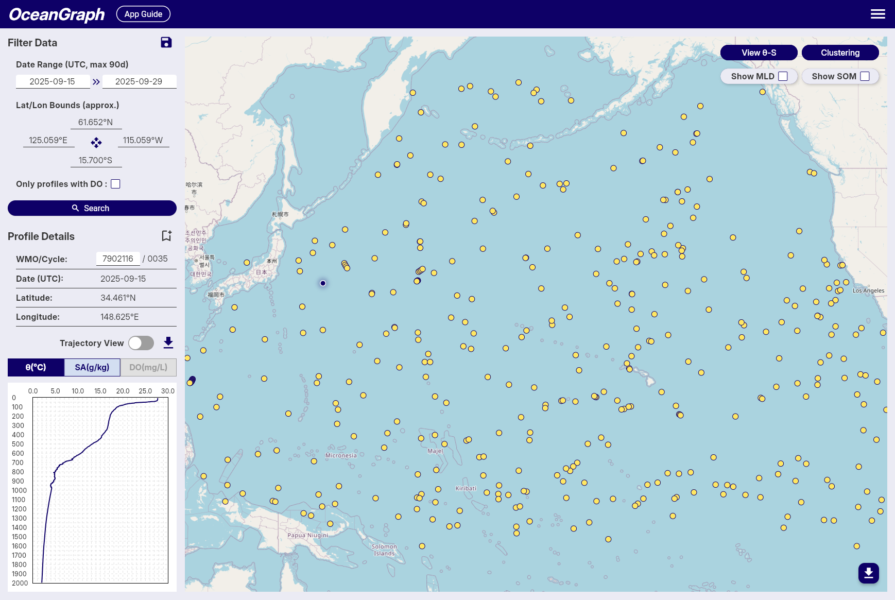

# Search and Bookmark

OceanGraph provides search capabilities to find Argo float profiles based on geographic, temporal, and data quality criteria.

## Search Methods

### Filter Data Panel

1. Date Range

   - Available: October 1999 to present
   - Click date fields to select start and end dates
   - All times in UTC

2. Geographic Bounds

   - Set by interacting with the map
   - Coordinates displayed with N/S/E/W format

3. Data Quality

   - "Only profiles with DO" checkbox for dissolved oxygen data

4. Save Search Conditions

   

    > **Note:** Available to signed-in users only

    - Click save icon to save current search parameters
    - Automatic naming by date range
    - Access saved searches across sessions

### Profile Details Panel

1. WMO ID Search

   - Enter WMO ID and press Enter
   - Returns all profiles for that specific float

2. Profile Information

   - WMO ID, Cycle Number, Date (UTC), Latitude, Longitude

3. Bookmark Profiles

   

    > **Note:** Available to signed-in users only

    - Click bookmark icon to save profiles
    - Status indication prevents duplicates
    - Access bookmarks across sessions

## Search Results

- Result count notification
- Profiles displayed as map markers
- Click markers to view profile details

## Tips

1. Start with broad searches, then narrow down
2. Use dissolved oxygen filter for biogeochemical studies
3. Save frequently used search patterns
4. Bookmark important profiles for future reference
5. **Rate Limits**: Signed-in users enjoy higher rate limits. If you experience access restrictions, consider creating a free account for uninterrupted access.
