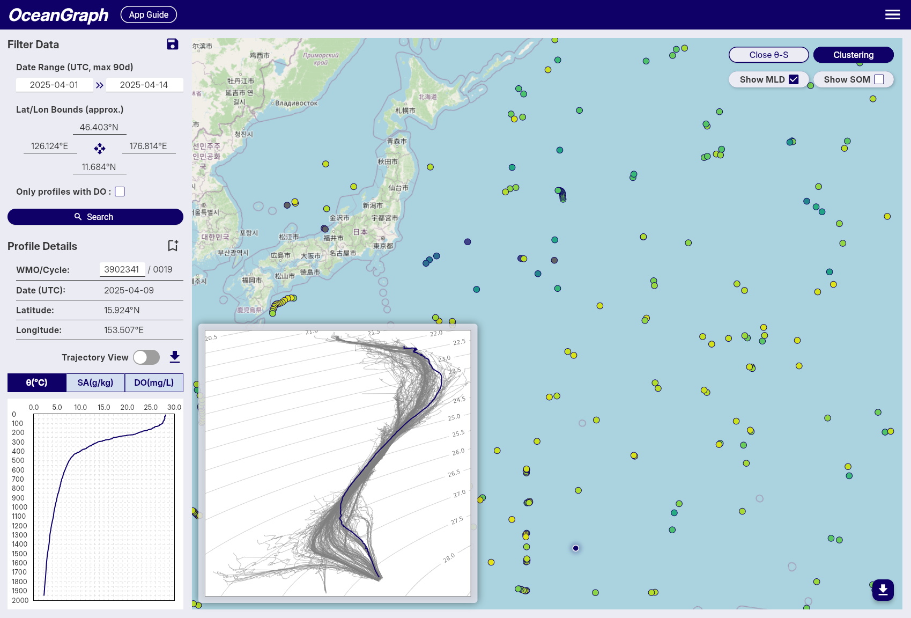
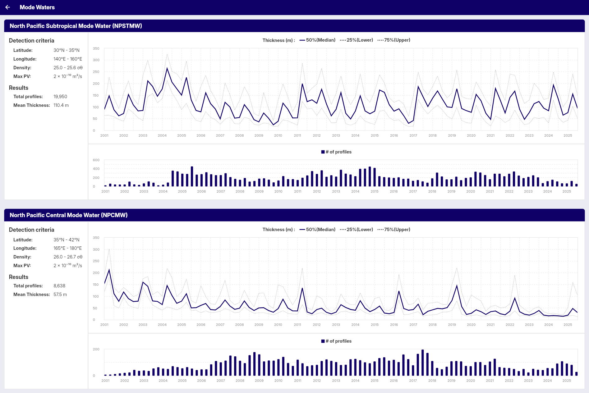

# Features

## For everyone

- Search Argo floats worldwide by region and time (up to a 30-day date range)
- Search only profiles that include dissolved oxygen data
- Search by WMO ID for direct access to specific floats
- Track individual float trajectories
- Visualize time-series vertical sections of Argo float data

**Note:** To prevent server overload, anonymous users are subject to request rate limits. If you experience rate limit restrictions, creating a free account and signing in will provide more generous rate limits for uninterrupted access.

## For signed-in users

All free features, plus:

- Search Argo floats with an extended date range (up to 90 days)
- Visualize vertical profiles of temperature, salinity, and oxygen
- View mixed layer depth from profile data
- View SOM (subsurface oxygen maximum) depth and its corresponding values
- Analyze T-S diagrams to explore water mass characteristics
- Download observation profile data for custom analysis
- Save screenshots of search results and visualizations
- Store up to 3 saved search conditions for repeated use (*)
- Bookmark up to 5 float profiles for later reference or comparison (*)
- Cluster Argo float profiles for pattern analysis
- Explore and compare ocean profiles with customizable tools
- Browse mode water analysis results

**(*) Titles can contain up to 64 characters, and notes up to 200 characters.**

