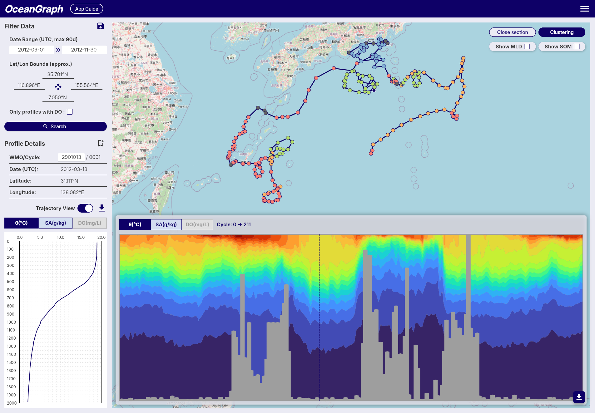

# Introduction

OceanGraph is a web platform for visualizing and analyzing Argo float oceanographic data. It offers interactive tools and profile information for researchers, students, and ocean enthusiasts.

Data is updated weekly, with approximately one week's worth of new data typically added every weekend. Updates and notifications about data availability are posted on X (Twitter) at [@OceanGraphJP](https://x.com/OceanGraphJP).

